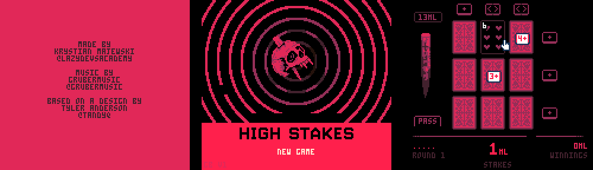

# High Stakes — Game Boy Color demake

An unofficial, fan-made port of Krystian Majewski's PICO-8 card game
[High Stakes](https://www.lexaloffle.com/bbs/?pid=83548) to the Game Boy Color.
It runs on real GBC hardware, the ModRetro Chromatic, and CGB emulators.

Las Vegas 2024. Vampires have stolen your blood. Flip cards, read the hint tokens,
stake the vampire before it gets you, and win it all back: every round, match and
opponent from the original, with its music, redrawn for a 160x144 screen.

*Not affiliated with or endorsed by the original authors, Lexaloffle Games or ModRetro.*



The ROM is `build/highstakes.gbc` (MBC5 + battery-backed SRAM, CGB-only).

## What's ported

The game logic is a line-by-line port of the original Lua (`assets/highstakes_original.lua`,
decoded from the cart):

- 3x3 board, one vampire + values 2–9, the auto-flipped opener, stakes, 5-round matches
- hint tokens: `+` (value floor), `<>` (neighbour comparison), the 2x2 vampire box
- line/column unlocks, the stake (stab bonus / stab penalty), pass with streak penalty
- dropped `+` tokens for Bafur/Houkin, Orlok's rigged box/hints ("asshole mode")
- bonus double-or-nothing round after 3+ wins, blood bank, buy-ins, death wipes progress,
  streaks, score mode with per-opponent high scores
- dialogue intro, opponent carousel, winnings / ending screens
- music and sfx: the cart's original PICO-8 sfx/pattern data is played by a small tracker
  engine on the GB APU, including the dynamic music layering that intensifies as fewer
  cards remain

All graphics come from the original sprite sheet, converted at build time: tiles are
quantised to GBC palettes (4 colours per 8x8 tile, 8 palettes), cards are redrawn at
21x29 to suit the 160x144 screen, and the card flip uses pre-rendered squash frames.

### Differences from the original

- Text uses PICO-8's 3x5 font, software-rendered into tiles.
- The title rings are animated by palette cycling instead of drawn circles.
- No card "lift" on hover or wobble animations.
- Music is an approximation: PICO-8 has four identical channels, the GB has two pulse,
  one wave and one noise channel, so voices are routed and custom instruments mapped.

## Controls

| Button | Action |
|--------|--------|
| D-pad  | move cursor / choose menu item |
| A      | flip card, pick up / place token, use stake, confirm (`❎` in the original) |
| B      | put back a held token / cancel the stake |
| Start  | same as A in menus |

## Building

Requirements: [GBDK-2020](https://github.com/gbdk-2020/gbdk-2020) 4.x and Python 3 (no extra packages).

```bash
make GBDK=~/tools/gbdk
```

`make` regenerates `src/gen/` from `assets/highstakes.p8.png` when the converter changes.
Graphics previews are written to `build/preview/`.

To play on a Chromatic, copy `build/highstakes.gbc` to a GBC flash cartridge.

## Layout

| Path | Contents |
|------|----------|
| `tools/p8cart.py` | PICO-8 `.p8.png` reader |
| `tools/gen_assets.py` | sprite sheet / font / audio → GBC tile, palette and data tables |
| `src/main.c` | boot, interrupts (window split, input latch) |
| `src/gfx.c` | canvases (software-rendered tile text), palettes and fades, sprites, frame loop |
| `src/sound.c` | PICO-8 sfx/music player for the GB APU (own ROM bank) |
| `src/game.c` | board gameplay, score panel, save data |
| `src/scenes.c` | credits, title, intro, opponent menu, bonus question, winnings, ending |

## Credits & licence

Original game by Krystian Majewski (Lazy Devs Academy), music by [Gruber](https://x.com/gruber_music),
based on a cover design by [Tyler Q Anderson](https://x.com/tandyq) and Jamie C Lee
([A Game By Its Cover Jam 2020](https://itch.io/jam/a-game-by-its-cover-2020)).

The original cartridge is licensed CC BY-NC-SA 4.0, so this port is too:
non-commercial use only, with attribution, under the same licence. See [LICENSE](LICENSE).

Built with [GBDK-2020](https://github.com/gbdk-2020/gbdk-2020).
